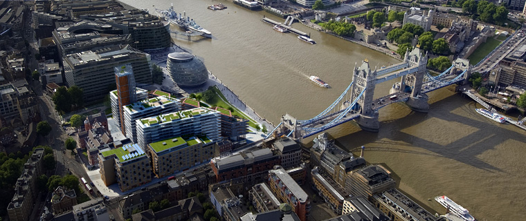
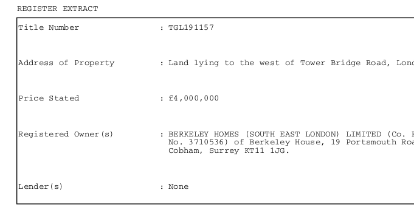
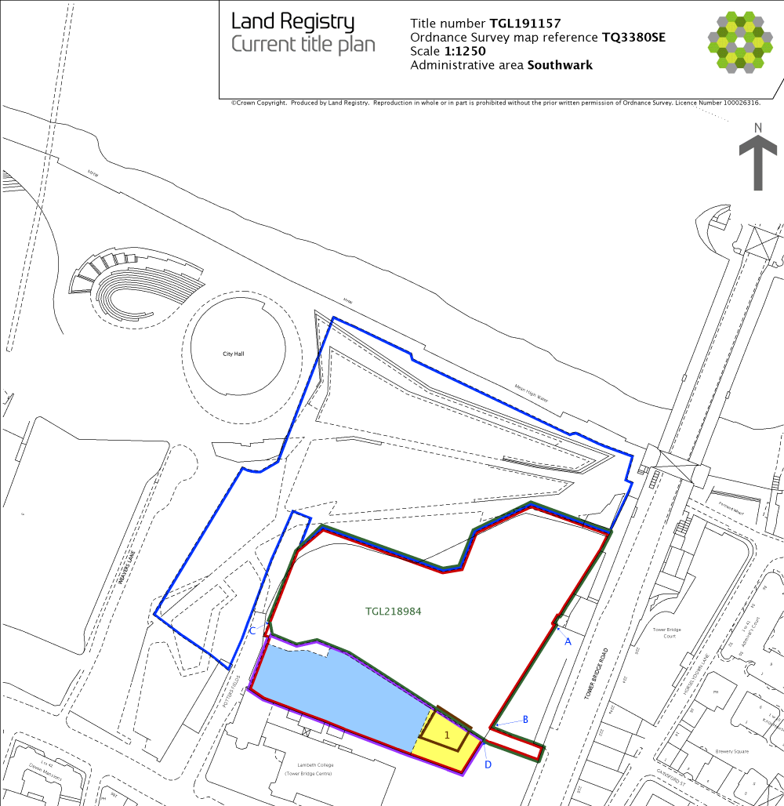
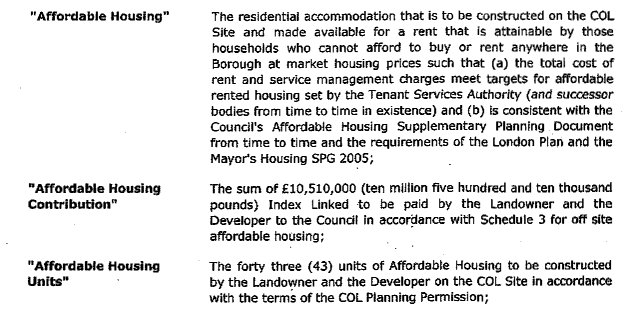

The land under what is now 'One Tower Bridge' used to be a coach park owned by Southwark Council.  

##

Southwark sold the land to Berkeley Homes in 2001 for £4m, but Berkeley sat on the land and banked it for 15 years before completing the development in 2016. 
##

## 

The agreed payment in lieu of providing affordable housing was £10m - a fraction of the scheme's gross development value.
## 

Southwark has an 'overage' agreement with Berkeley homes, meaning that they will receive a 'share' of the final profit. We made an [FOI request](https://www.whatdotheyknow.com/request/one_tower_bridge_overage_agreeme) to the Council asking how much overage it had received. We didn't get an answer.
